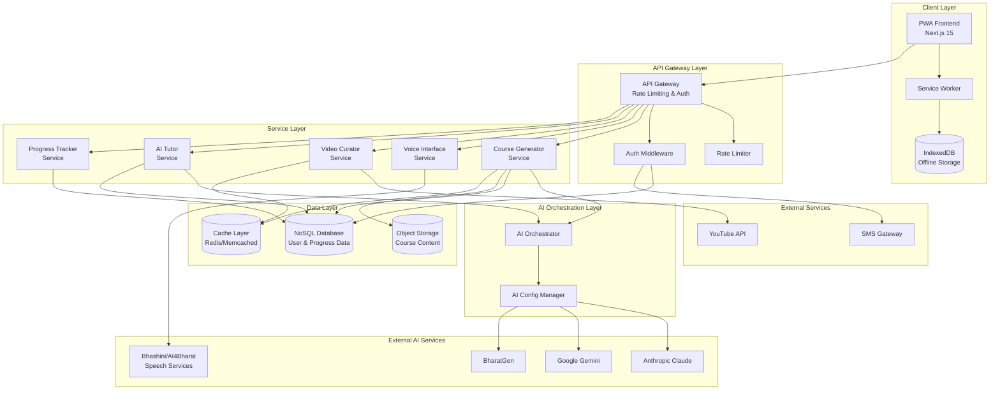

# Design Document: AI Vidya for Bharat

## Overview

AI Vidya for Bharat is a multilingual, voice-first educational platform designed to democratize learning across India. The system leverages AI to generate personalized courses in 22 Indian languages plus English, integrates context-aware video content, and provides offline capabilities for learners with limited connectivity.

### Core Design Principles

1. **Cloud-Agnostic Architecture**: All cloud provider dependencies abstracted behind interfaces
2. **Voice-First Experience**: Speech input/output as primary interaction mode
3. **Offline-First PWA**: Progressive Web App with robust offline capabilities
4. **Modular & Serverless**: Stateless, independently deployable services
5. **Privacy-Aware**: Minimal PII storage with strong encryption
6. **Accessibility-First**: WCAG 2.1 AA compliant design

### Technology Stack

**Frontend:**
- Next.js 15 (App Router)
- React 18+ (Server & Client Components)
- Tailwind CSS + Shadcn UI
- Service Workers for offline support

**Backend:**
- Serverless functions (AWS Lambda / Vercel Functions)
- Node.js runtime
- TypeScript for type safety

**AI Services:**
- Anthropic Claude / Google Gemini / BharatGen (configurable)
- Bhashini / AI4Bharat for speech services

**Data Storage:**
- NoSQL database (DynamoDB / MongoDB)
- Object storage (S3 / equivalent)
- Client-side IndexedDB for offline data

## Architecture

### High-Level System Architecture



### Layered Architecture


**Layer 1: Presentation Layer (Frontend)**
- Next.js App Router with Server/Client Components
- Progressive Web App with service worker
- Responsive, mobile-first UI
- Offline-capable with IndexedDB

**Layer 2: API Gateway Layer**
- Request routing and validation
- Authentication & authorization
- Rate limiting enforcement
- CORS and security headers
- Request/response logging

**Layer 3: Service Layer**
- Course Generator Service
- Voice Interface Service
- Video Curator Service
- AI Tutor Service
- Progress Tracker Service
- Offline Manager Service

**Layer 4: AI Orchestration Layer**
- Provider-agnostic AI interface
- Configuration-driven model selection
- Fallback and retry logic
- Response caching

**Layer 5: Data Access Layer**
- Database abstraction interfaces
- Connection pooling
- Retry logic for transient failures
- Schema migration support

## Components and Interfaces

### 1. Course Generator Service

**Responsibility**: Generate structured, multilingual educational courses using AI.

**Interface:**
```typescript
interface CourseGeneratorService {
  generateCourse(request: CourseGenerationRequest): Promise<Course>;
  validateTopic(topic: string): Promise<boolean>;
}

interface CourseGenerationRequest {
  topic: string;
  language: SupportedLanguage;
  userId: string;
}

interface Course {
  id: string;
  topic: string;
  language: SupportedLanguage;
  chapters: Chapter[];
  createdAt: Date;
}

interface Chapter {
  id: string;
  title: string;
  content: string;
  learningObjectives: string[];
  examples: string[];
  order: number;
}

type SupportedLanguage = 
  | 'en' | 'hi' | 'bn' | 'te' | 'mr' | 'ta' | 'gu' | 'kn' 
  | 'ml' | 'pa' | 'or' | 'as' | 'ur' | 'ks' | 'sd' | 'sa'
  | 'ne' | 'ko' | 'mai' | 'bo' | 'mni' | 'doi' | 'sat';
```

**Implementation Details:**
- Uses AI Orchestrator to call configured LLM
- Validates topic for educational appropriateness
- Generates 5-8 chapters per course
- Includes Indian context-specific examples
- Outputs strict JSON format
- Implements retry logic (max 3 attempts per section)
- Caches generated courses for 24 hours


**AI Prompt Strategy:**
```
System: You are an educational content creator for Indian learners. Generate a course in {language} on {topic}.

Requirements:
- Create 5-8 chapters
- Each chapter must have: title, content, learning objectives, examples
- Use Indian cultural context in examples
- Language: {language}
- Output format: strict JSON

JSON Schema:
{
  "topic": "string",
  "language": "string",
  "chapters": [
    {
      "title": "string",
      "content": "string",
      "learningObjectives": ["string"],
      "examples": ["string"]
    }
  ]
}
```

### 2. Voice Interface Service

**Responsibility**: Convert speech to text and text to speech for multilingual voice interaction.

**Interface:**
```typescript
interface VoiceInterfaceService {
  speechToText(audio: AudioBlob, language: SupportedLanguage): Promise<TranscriptionResult>;
  textToSpeech(text: string, language: SupportedLanguage): Promise<AudioBlob>;
}

interface TranscriptionResult {
  text: string;
  confidence: number;
  language: SupportedLanguage;
  containsCodeSwitching: boolean;
}

interface AudioBlob {
  data: Uint8Array;
  format: 'wav' | 'mp3' | 'ogg';
  duration: number;
}
```

**Implementation Details:**
- Integrates with Bhashini or AI4Bharat APIs
- Supports all 22 scheduled Indian languages + English
- Handles code-switching (Hinglish, Tanglish, etc.)
- Processing time: <3s for audio <30s (STT), <2s for text <500 chars (TTS)
- Implements audio quality validation
- Does not persist raw audio beyond processing
- Provides playback controls (pause, resume, speed)

**Bhashini Integration:**
```typescript
interface BhashiniConfig {
  apiKey: string;
  endpoint: string;
  serviceId: string;
}

class BhashiniAdapter implements VoiceInterfaceService {
  async speechToText(audio: AudioBlob, language: SupportedLanguage): Promise<TranscriptionResult> {
    // Call Bhashini ASR API
    // Handle code-switching detection
    // Return transcription with confidence score
  }
  
  async textToSpeech(text: string, language: SupportedLanguage): Promise<AudioBlob> {
    // Call Bhashini TTS API
    // Handle code-switching pronunciation
    // Return audio blob
  }
}
```


### 3. Video Curator Service

**Responsibility**: Discover and filter relevant educational videos from YouTube.

**Interface:**
```typescript
interface VideoCuratorService {
  findVideos(request: VideoSearchRequest): Promise<VideoRecommendation[]>;
  reportInappropriate(videoId: string, userId: string, reason: string): Promise<void>;
}

interface VideoSearchRequest {
  chapterTitle: string;
  chapterContent: string;
  language: SupportedLanguage;
  maxResults: number; // 2-5
}

interface VideoRecommendation {
  videoId: string;
  title: string;
  channelName: string;
  duration: number; // seconds
  thumbnailUrl: string;
  hasSubtitles: boolean;
  relevanceScore: number;
}
```

**Implementation Details:**
- Uses YouTube Data API v3
- Filters by language, duration (3-20 min), relevance
- Prioritizes verified educational channels
- Maintains blocklist of inappropriate content
- Returns 2-5 videos per chapter (or empty array)
- Caches results for 7 days
- Refreshes recommendations weekly
- Removes reported videos within 24 hours

**Filtering Algorithm:**
```typescript
async function filterVideos(videos: YouTubeVideo[], criteria: FilterCriteria): Promise<VideoRecommendation[]> {
  return videos
    .filter(v => v.duration >= 180 && v.duration <= 1200) // 3-20 min
    .filter(v => !isInBlocklist(v.videoId))
    .filter(v => !v.contentWarnings)
    .filter(v => matchesLanguage(v, criteria.language))
    .filter(v => isRelevant(v, criteria.topic))
    .sort((a, b) => {
      // Prioritize: subtitles > verified channels > relevance
      if (a.hasSubtitles && !b.hasSubtitles) return -1;
      if (b.hasSubtitles && !a.hasSubtitles) return 1;
      if (a.isVerified && !b.isVerified) return -1;
      if (b.isVerified && !a.isVerified) return 1;
      return b.relevanceScore - a.relevanceScore;
    })
    .slice(0, criteria.maxResults);
}
```

### 4. AI Tutor Service

**Responsibility**: Provide conversational AI assistance in user's preferred language.

**Interface:**
```typescript
interface AITutorService {
  sendMessage(request: TutorMessageRequest): Promise<TutorResponse>;
  getConversationHistory(userId: string, courseId: string): Promise<Message[]>;
  clearHistory(userId: string, courseId: string): Promise<void>;
}

interface TutorMessageRequest {
  userId: string;
  courseId: string;
  message: string;
  language: SupportedLanguage;
  sessionId: string;
}

interface TutorResponse {
  message: string;
  language: SupportedLanguage;
  timestamp: Date;
}

interface Message {
  id: string;
  role: 'user' | 'assistant';
  content: string;
  timestamp: Date;
}
```


**Implementation Details:**
- Maintains conversation context per session
- Supports all 22 Indian languages + English
- Recognizes and responds to code-switching
- Uses Indian context in explanations
- Response time: <5s under normal load
- Persists conversation history (30 days, max 100 messages)
- Archives older messages when limit reached
- Guides users back to course content when off-topic

**Conversation Context Management:**
```typescript
class ConversationContextManager {
  private contexts: Map<string, ConversationContext> = new Map();
  
  async getContext(sessionId: string): Promise<ConversationContext> {
    if (!this.contexts.has(sessionId)) {
      // Load from database
      const history = await this.loadHistory(sessionId);
      this.contexts.set(sessionId, {
        messages: history.slice(-10), // Last 10 messages for context
        courseInfo: await this.loadCourseInfo(sessionId)
      });
    }
    return this.contexts.get(sessionId)!;
  }
  
  async addMessage(sessionId: string, message: Message): Promise<void> {
    const context = await this.getContext(sessionId);
    context.messages.push(message);
    
    // Keep only last 10 in memory
    if (context.messages.length > 10) {
      context.messages.shift();
    }
    
    // Persist to database
    await this.saveMessage(sessionId, message);
  }
}
```

### 5. Progress Tracker Service

**Responsibility**: Track and persist user learning progress.

**Interface:**
```typescript
interface ProgressTrackerService {
  markChapterComplete(userId: string, courseId: string, chapterId: string): Promise<void>;
  getProgress(userId: string, courseId: string): Promise<CourseProgress>;
  syncOfflineProgress(userId: string, updates: ProgressUpdate[]): Promise<void>;
}

interface CourseProgress {
  courseId: string;
  completedChapters: string[];
  completionPercentage: number;
  lastAccessedAt: Date;
  totalTimeSpent: number; // seconds
}

interface ProgressUpdate {
  courseId: string;
  chapterId: string;
  completedAt: Date;
  offline: boolean;
}
```

**Implementation Details:**
- Tracks progress at chapter level
- Calculates completion percentage
- Persists within 10 seconds of completion
- Queues updates when offline
- Syncs queued updates on reconnection
- Maintains history for 90 days
- Displays most recent state on return

**Offline Sync Strategy:**
```typescript
class OfflineProgressQueue {
  private queue: ProgressUpdate[] = [];
  
  async enqueue(update: ProgressUpdate): Promise<void> {
    this.queue.push(update);
    await this.saveToIndexedDB(this.queue);
  }
  
  async sync(): Promise<void> {
    if (!navigator.onLine || this.queue.length === 0) return;
    
    try {
      await this.progressTracker.syncOfflineProgress(this.userId, this.queue);
      this.queue = [];
      await this.clearIndexedDB();
    } catch (error) {
      // Retry on next sync attempt
      console.error('Sync failed, will retry', error);
    }
  }
}
```


### 6. Offline Manager Service

**Responsibility**: Manage offline content storage and synchronization.

**Interface:**
```typescript
interface OfflineManagerService {
  pinCourse(userId: string, courseId: string): Promise<void>;
  unpinCourse(userId: string, courseId: string): Promise<void>;
  getPinnedCourses(userId: string): Promise<Course[]>;
  getStorageUsage(userId: string): Promise<StorageInfo>;
}

interface StorageInfo {
  usedBytes: number;
  limitBytes: number; // 100 MB
  availableBytes: number;
}
```

**Implementation Details:**
- Downloads course content to IndexedDB
- Stores chapter text, objectives, metadata
- Enforces 100 MB per user limit
- Prompts to unpin when limit reached
- Syncs progress on reconnection
- Shows offline indicator in UI

**IndexedDB Schema:**
```typescript
// Database: ai-vidya-offline
// Version: 1

// Store: courses
interface OfflineCourse {
  id: string; // courseId
  userId: string;
  topic: string;
  language: string;
  chapters: OfflineChapter[];
  pinnedAt: Date;
  sizeBytes: number;
}

// Store: progress-queue
interface QueuedProgress {
  id: string;
  userId: string;
  courseId: string;
  chapterId: string;
  completedAt: Date;
  synced: boolean;
}

// Store: settings
interface UserSettings {
  userId: string;
  lowBandwidthMode: boolean;
  preferredLanguage: string;
}
```

### 7. AI Orchestrator

**Responsibility**: Abstract AI provider selection and manage AI interactions.

**Interface:**
```typescript
interface AIOrchestrator {
  generateText(prompt: string, config: GenerationConfig): Promise<string>;
  getAvailableProviders(): Promise<AIProvider[]>;
}

interface GenerationConfig {
  provider?: 'claude' | 'gemini' | 'bharatgen' | 'auto';
  temperature?: number;
  maxTokens?: number;
  language?: SupportedLanguage;
}

interface AIProvider {
  name: string;
  available: boolean;
  latency: number;
  costPerToken: number;
}
```

**Implementation Details:**
- Configuration-driven provider selection
- Supports Anthropic Claude, Google Gemini, BharatGen
- Implements fallback logic
- No hard-coded provider endpoints
- Logs failures with descriptive errors
- Caches responses when appropriate


**Provider Abstraction:**
```typescript
interface AIProviderAdapter {
  generateText(prompt: string, config: GenerationConfig): Promise<string>;
  isAvailable(): Promise<boolean>;
}

class ClaudeAdapter implements AIProviderAdapter {
  constructor(private config: ClaudeConfig) {}
  
  async generateText(prompt: string, config: GenerationConfig): Promise<string> {
    const response = await fetch(this.config.endpoint, {
      method: 'POST',
      headers: {
        'x-api-key': this.config.apiKey,
        'anthropic-version': '2023-06-01',
        'content-type': 'application/json'
      },
      body: JSON.stringify({
        model: this.config.model,
        messages: [{ role: 'user', content: prompt }],
        max_tokens: config.maxTokens || 4096,
        temperature: config.temperature || 0.7
      })
    });
    
    if (!response.ok) {
      throw new AIProviderError(`Claude API failed: ${response.statusText}`);
    }
    
    const data = await response.json();
    return data.content[0].text;
  }
  
  async isAvailable(): Promise<boolean> {
    try {
      await fetch(this.config.endpoint, { method: 'HEAD' });
      return true;
    } catch {
      return false;
    }
  }
}

// Similar adapters for Gemini, BharatGen
```

**Configuration Management:**
```typescript
// config/ai-providers.ts
interface AIProvidersConfig {
  providers: {
    claude?: ClaudeConfig;
    gemini?: GeminiConfig;
    bharatgen?: BharatGenConfig;
  };
  defaultProvider: string;
  fallbackOrder: string[];
}

// Loaded from environment variables
const config: AIProvidersConfig = {
  providers: {
    claude: {
      apiKey: process.env.ANTHROPIC_API_KEY!,
      endpoint: process.env.ANTHROPIC_ENDPOINT || 'https://api.anthropic.com/v1/messages',
      model: process.env.ANTHROPIC_MODEL || 'claude-3-sonnet-20240229'
    },
    gemini: {
      apiKey: process.env.GOOGLE_API_KEY!,
      endpoint: process.env.GEMINI_ENDPOINT || 'https://generativelanguage.googleapis.com/v1/models',
      model: process.env.GEMINI_MODEL || 'gemini-pro'
    }
  },
  defaultProvider: process.env.DEFAULT_AI_PROVIDER || 'claude',
  fallbackOrder: ['claude', 'gemini', 'bharatgen']
};
```

### 8. Authentication Service

**Responsibility**: Handle user authentication and session management.

**Interface:**
```typescript
interface AuthService {
  sendOTP(phoneNumber: string): Promise<void>;
  verifyOTP(phoneNumber: string, otp: string): Promise<AuthToken>;
  verifySession(token: string): Promise<User>;
  refreshToken(token: string): Promise<AuthToken>;
  logout(token: string): Promise<void>;
}

interface AuthToken {
  token: string;
  expiresAt: Date;
  userId: string;
}

interface User {
  id: string;
  phoneNumber?: string;
  email?: string;
  tier: UserTier;
  createdAt: Date;
}

type UserTier = 'free' | 'basic' | 'premium';
```


**Implementation Details:**
- Primary: Mobile OTP authentication
- Alternative: Email authentication
- OTP valid for 10 minutes
- Session token valid for 30 days
- Stores only hashed credentials
- Blocks account for 15 min after 5 failed attempts
- Session validation middleware on all protected routes

**OTP Flow:**
```typescript
class OTPAuthService implements AuthService {
  async sendOTP(phoneNumber: string): Promise<void> {
    // Generate 6-digit OTP
    const otp = this.generateOTP();
    
    // Store hashed OTP with expiry (10 min)
    await this.otpStore.set(phoneNumber, {
      hash: await this.hash(otp),
      expiresAt: new Date(Date.now() + 10 * 60 * 1000),
      attempts: 0
    });
    
    // Send via SMS gateway
    await this.smsGateway.send(phoneNumber, `Your AI Vidya OTP: ${otp}`);
  }
  
  async verifyOTP(phoneNumber: string, otp: string): Promise<AuthToken> {
    const stored = await this.otpStore.get(phoneNumber);
    
    if (!stored || stored.expiresAt < new Date()) {
      throw new AuthError('OTP expired');
    }
    
    if (stored.attempts >= 5) {
      throw new AuthError('Too many attempts. Try again in 15 minutes.');
    }
    
    if (!await this.verify(otp, stored.hash)) {
      stored.attempts++;
      await this.otpStore.set(phoneNumber, stored);
      throw new AuthError('Invalid OTP');
    }
    
    // Create or get user
    const user = await this.getOrCreateUser(phoneNumber);
    
    // Generate session token
    const token = await this.generateToken(user.id);
    
    return {
      token,
      expiresAt: new Date(Date.now() + 30 * 24 * 60 * 60 * 1000),
      userId: user.id
    };
  }
}
```

### 9. Rate Limiter Service

**Responsibility**: Enforce usage limits based on user tier.

**Interface:**
```typescript
interface RateLimiterService {
  checkLimit(userId: string, action: RateLimitAction): Promise<RateLimitResult>;
  getRemainingQuota(userId: string, action: RateLimitAction): Promise<number>;
}

type RateLimitAction = 
  | 'course_generation'
  | 'ai_tutor_message'
  | 'voice_input';

interface RateLimitResult {
  allowed: boolean;
  remaining: number;
  resetAt: Date;
}
```

**Rate Limit Configuration:**
```typescript
const RATE_LIMITS: Record<UserTier, Record<RateLimitAction, RateLimit>> = {
  free: {
    course_generation: { limit: 3, window: 'day' },
    ai_tutor_message: { limit: 20, window: 'hour' },
    voice_input: { limit: 50, window: 'hour' }
  },
  basic: {
    course_generation: { limit: 10, window: 'day' },
    ai_tutor_message: { limit: 100, window: 'hour' },
    voice_input: { limit: 200, window: 'hour' }
  },
  premium: {
    course_generation: { limit: 50, window: 'day' },
    ai_tutor_message: { limit: 500, window: 'hour' },
    voice_input: { limit: 1000, window: 'hour' }
  }
};
```


**Implementation:**
```typescript
class RedisRateLimiter implements RateLimiterService {
  async checkLimit(userId: string, action: RateLimitAction): Promise<RateLimitResult> {
    const user = await this.getUser(userId);
    const config = RATE_LIMITS[user.tier][action];
    const key = `ratelimit:${userId}:${action}:${this.getWindow(config.window)}`;
    
    const current = await this.redis.incr(key);
    
    if (current === 1) {
      // First request in window, set expiry
      const ttl = config.window === 'hour' ? 3600 : 86400;
      await this.redis.expire(key, ttl);
    }
    
    const allowed = current <= config.limit;
    const resetAt = await this.getResetTime(key);
    
    return {
      allowed,
      remaining: Math.max(0, config.limit - current),
      resetAt
    };
  }
  
  private getWindow(window: 'hour' | 'day'): string {
    const now = new Date();
    if (window === 'hour') {
      return `${now.getUTCFullYear()}-${now.getUTCMonth()}-${now.getUTCDate()}-${now.getUTCHours()}`;
    }
    return `${now.getUTCFullYear()}-${now.getUTCMonth()}-${now.getUTCDate()}`;
  }
}
```

## Data Models

### Database Schema (NoSQL)

**Users Collection:**
```typescript
interface UserDocument {
  id: string; // UUID
  phoneNumber?: string; // hashed
  email?: string; // hashed
  tier: UserTier;
  preferences: {
    language: SupportedLanguage;
    lowBandwidthMode: boolean;
  };
  createdAt: Date;
  lastLoginAt: Date;
  // PII encrypted at rest
}
```

**Courses Collection:**
```typescript
interface CourseDocument {
  id: string; // UUID
  userId: string;
  topic: string;
  language: SupportedLanguage;
  chapters: ChapterDocument[];
  createdAt: Date;
  updatedAt: Date;
  storageKey: string; // S3/object storage key
}

interface ChapterDocument {
  id: string;
  title: string;
  content: string;
  learningObjectives: string[];
  examples: string[];
  order: number;
  videos: VideoReference[];
}

interface VideoReference {
  videoId: string;
  title: string;
  channelName: string;
  duration: number;
  thumbnailUrl: string;
}
```

**Progress Collection:**
```typescript
interface ProgressDocument {
  id: string; // userId:courseId
  userId: string;
  courseId: string;
  completedChapters: {
    chapterId: string;
    completedAt: Date;
  }[];
  totalTimeSpent: number;
  lastAccessedAt: Date;
  createdAt: Date;
}
```

**Conversations Collection:**
```typescript
interface ConversationDocument {
  id: string; // userId:courseId
  userId: string;
  courseId: string;
  messages: ConversationMessage[];
  createdAt: Date;
  updatedAt: Date;
}

interface ConversationMessage {
  id: string;
  role: 'user' | 'assistant';
  content: string;
  timestamp: Date;
  language: SupportedLanguage;
}
```


**Sessions Collection:**
```typescript
interface SessionDocument {
  id: string; // token hash
  userId: string;
  createdAt: Date;
  expiresAt: Date;
  lastActivityAt: Date;
  deviceInfo: {
    userAgent: string;
    ip: string; // hashed
  };
}
```

**Blocklist Collection:**
```typescript
interface BlocklistDocument {
  id: string; // videoId or channelId
  type: 'video' | 'channel';
  reason: string;
  reportedBy: string; // userId
  reportedAt: Date;
  status: 'pending' | 'confirmed' | 'rejected';
}
```

### Object Storage Structure

```
s3://ai-vidya-courses/
  ├── {userId}/
  │   ├── {courseId}/
  │   │   ├── metadata.json
  │   │   ├── chapters/
  │   │   │   ├── {chapterId}.json
  │   │   │   └── ...
  │   │   └── cache/
  │   │       └── videos.json
  │   └── ...
  └── ...

s3://ai-vidya-assets/
  ├── images/
  │   ├── compressed/
  │   └── original/
  └── static/
      ├── icons/
      └── manifest/
```

### API Specifications

**Base URL:** `https://api.aividya.in/v1`

**Authentication:** Bearer token in `Authorization` header

#### 1. Course Generation API

**POST /courses/generate**

Request:
```json
{
  "topic": "Introduction to Python Programming",
  "language": "hi"
}
```

Response (200):
```json
{
  "courseId": "uuid",
  "topic": "Introduction to Python Programming",
  "language": "hi",
  "chapters": [
    {
      "id": "uuid",
      "title": "पायथन की मूल बातें",
      "content": "...",
      "learningObjectives": ["..."],
      "examples": ["..."],
      "order": 1,
      "videos": [
        {
          "videoId": "youtube-id",
          "title": "...",
          "duration": 600
        }
      ]
    }
  ],
  "createdAt": "2024-01-01T00:00:00Z"
}
```

Error (429):
```json
{
  "error": "Rate limit exceeded",
  "resetAt": "2024-01-02T00:00:00Z",
  "remaining": 0
}
```

#### 2. Voice Input API

**POST /voice/transcribe**

Request (multipart/form-data):
```
audio: <audio file>
language: hi
```

Response (200):
```json
{
  "text": "मुझे पायथन सीखना है",
  "confidence": 0.95,
  "language": "hi",
  "containsCodeSwitching": false
}
```

#### 3. Voice Output API

**POST /voice/synthesize**

Request:
```json
{
  "text": "यह एक उदाहरण है",
  "language": "hi"
}
```

Response (200):
```
Content-Type: audio/mpeg
<audio binary data>
```


#### 4. AI Tutor API

**POST /tutor/message**

Request:
```json
{
  "courseId": "uuid",
  "message": "Python में loop कैसे काम करता है?",
  "language": "hi",
  "sessionId": "uuid"
}
```

Response (200):
```json
{
  "message": "Python में loop का उपयोग...",
  "language": "hi",
  "timestamp": "2024-01-01T00:00:00Z"
}
```

**GET /tutor/history/:courseId**

Response (200):
```json
{
  "messages": [
    {
      "id": "uuid",
      "role": "user",
      "content": "...",
      "timestamp": "2024-01-01T00:00:00Z"
    },
    {
      "id": "uuid",
      "role": "assistant",
      "content": "...",
      "timestamp": "2024-01-01T00:00:01Z"
    }
  ]
}
```

#### 5. Progress API

**POST /progress/complete**

Request:
```json
{
  "courseId": "uuid",
  "chapterId": "uuid"
}
```

Response (200):
```json
{
  "success": true,
  "completionPercentage": 25
}
```

**GET /progress/:courseId**

Response (200):
```json
{
  "courseId": "uuid",
  "completedChapters": ["uuid1", "uuid2"],
  "completionPercentage": 25,
  "lastAccessedAt": "2024-01-01T00:00:00Z",
  "totalTimeSpent": 3600
}
```

#### 6. Offline API

**POST /offline/pin**

Request:
```json
{
  "courseId": "uuid"
}
```

Response (200):
```json
{
  "success": true,
  "storageUsed": 45000000,
  "storageLimit": 104857600
}
```

Error (413):
```json
{
  "error": "Storage limit exceeded",
  "storageUsed": 104857600,
  "storageLimit": 104857600,
  "message": "Please unpin some courses before pinning new ones"
}
```

**POST /offline/sync**

Request:
```json
{
  "progressUpdates": [
    {
      "courseId": "uuid",
      "chapterId": "uuid",
      "completedAt": "2024-01-01T00:00:00Z"
    }
  ]
}
```

Response (200):
```json
{
  "synced": 5,
  "failed": 0
}
```

#### 7. Authentication API

**POST /auth/send-otp**

Request:
```json
{
  "phoneNumber": "+919876543210"
}
```

Response (200):
```json
{
  "success": true,
  "expiresIn": 600
}
```

**POST /auth/verify-otp**

Request:
```json
{
  "phoneNumber": "+919876543210",
  "otp": "123456"
}
```

Response (200):
```json
{
  "token": "jwt-token",
  "expiresAt": "2024-02-01T00:00:00Z",
  "user": {
    "id": "uuid",
    "tier": "free"
  }
}
```


## Frontend Architecture

### Next.js 15 App Router Structure

```
app/
├── (auth)/
│   ├── login/
│   │   └── page.tsx (Client Component)
│   └── verify/
│       └── page.tsx (Client Component)
├── (dashboard)/
│   ├── layout.tsx (Server Component with auth check)
│   ├── page.tsx (Dashboard - Server Component)
│   ├── courses/
│   │   ├── page.tsx (Course list - Server Component)
│   │   ├── [courseId]/
│   │   │   ├── page.tsx (Course detail - Server Component)
│   │   │   └── chapter/[chapterId]/
│   │   │       └── page.tsx (Chapter view - hybrid)
│   │   └── new/
│   │       └── page.tsx (Course generation - Client Component)
│   ├── tutor/
│   │   └── [courseId]/
│   │       └── page.tsx (AI Tutor chat - Client Component)
│   └── settings/
│       └── page.tsx (Settings - Client Component)
├── api/
│   ├── courses/
│   │   ├── generate/
│   │   │   └── route.ts
│   │   └── [courseId]/
│   │       └── route.ts
│   ├── voice/
│   │   ├── transcribe/
│   │   │   └── route.ts
│   │   └── synthesize/
│   │       └── route.ts
│   ├── tutor/
│   │   ├── message/
│   │   │   └── route.ts
│   │   └── history/[courseId]/
│   │       └── route.ts
│   ├── progress/
│   │   ├── complete/
│   │   │   └── route.ts
│   │   └── [courseId]/
│   │       └── route.ts
│   ├── offline/
│   │   ├── pin/
│   │   │   └── route.ts
│   │   └── sync/
│   │       └── route.ts
│   └── auth/
│       ├── send-otp/
│       │   └── route.ts
│       └── verify-otp/
│           └── route.ts
├── layout.tsx (Root layout with PWA setup)
└── globals.css

components/
├── ui/ (Shadcn components)
│   ├── button.tsx
│   ├── card.tsx
│   ├── input.tsx
│   ├── dialog.tsx
│   └── ...
├── course/
│   ├── CourseCard.tsx (Client)
│   ├── ChapterList.tsx (Server)
│   ├── VideoPlayer.tsx (Client)
│   └── ProgressBar.tsx (Client)
├── voice/
│   ├── VoiceInput.tsx (Client)
│   ├── VoiceOutput.tsx (Client)
│   └── AudioControls.tsx (Client)
├── tutor/
│   ├── ChatInterface.tsx (Client)
│   ├── MessageBubble.tsx (Client)
│   └── TypingIndicator.tsx (Client)
├── offline/
│   ├── OfflineIndicator.tsx (Client)
│   ├── PinButton.tsx (Client)
│   └── SyncStatus.tsx (Client)
└── layout/
    ├── Header.tsx (Server)
    ├── Navigation.tsx (Client)
    └── Footer.tsx (Server)

lib/
├── api/
│   ├── client.ts (API client with auth)
│   ├── courses.ts
│   ├── voice.ts
│   ├── tutor.ts
│   └── progress.ts
├── offline/
│   ├── db.ts (IndexedDB wrapper)
│   ├── sync.ts (Sync manager)
│   └── storage.ts (Storage manager)
├── auth/
│   ├── session.ts
│   └── middleware.ts
└── utils/
    ├── language.ts
    └── format.ts

public/
├── manifest.json
├── sw.js (Service Worker)
├── icons/
│   ├── icon-192.png
│   └── icon-512.png
└── offline.html
```


### Progressive Web App Configuration

**manifest.json:**
```json
{
  "name": "AI Vidya for Bharat",
  "short_name": "AI Vidya",
  "description": "Multilingual AI-powered learning platform",
  "start_url": "/",
  "display": "standalone",
  "background_color": "#ffffff",
  "theme_color": "#4F46E5",
  "orientation": "portrait",
  "icons": [
    {
      "src": "/icons/icon-192.png",
      "sizes": "192x192",
      "type": "image/png",
      "purpose": "any maskable"
    },
    {
      "src": "/icons/icon-512.png",
      "sizes": "512x512",
      "type": "image/png",
      "purpose": "any maskable"
    }
  ],
  "categories": ["education", "productivity"],
  "lang": "en",
  "dir": "ltr"
}
```

**Service Worker Strategy:**
```typescript
// public/sw.js
const CACHE_NAME = 'ai-vidya-v1';
const OFFLINE_URL = '/offline.html';

const STATIC_ASSETS = [
  '/',
  '/offline.html',
  '/icons/icon-192.png',
  '/icons/icon-512.png',
  '/_next/static/css/app.css'
];

// Install: Cache static assets
self.addEventListener('install', (event) => {
  event.waitUntil(
    caches.open(CACHE_NAME).then((cache) => cache.addAll(STATIC_ASSETS))
  );
});

// Fetch: Network-first for API, cache-first for static assets
self.addEventListener('fetch', (event) => {
  const { request } = event;
  const url = new URL(request.url);
  
  // API requests: Network-first
  if (url.pathname.startsWith('/api/')) {
    event.respondWith(
      fetch(request)
        .catch(() => new Response(
          JSON.stringify({ error: 'Offline', offline: true }),
          { headers: { 'Content-Type': 'application/json' } }
        ))
    );
    return;
  }
  
  // Static assets: Cache-first
  event.respondWith(
    caches.match(request).then((response) => {
      return response || fetch(request).then((fetchResponse) => {
        return caches.open(CACHE_NAME).then((cache) => {
          cache.put(request, fetchResponse.clone());
          return fetchResponse;
        });
      });
    }).catch(() => caches.match(OFFLINE_URL))
  );
});
```

### Component Design Patterns

**Voice Input Component:**
```typescript
'use client';

import { useState, useRef } from 'react';
import { Button } from '@/components/ui/button';
import { Mic, MicOff } from 'lucide-react';

export function VoiceInput({ 
  language, 
  onTranscript 
}: { 
  language: string; 
  onTranscript: (text: string) => void;
}) {
  const [isRecording, setIsRecording] = useState(false);
  const [error, setError] = useState<string | null>(null);
  const mediaRecorderRef = useRef<MediaRecorder | null>(null);
  
  const startRecording = async () => {
    try {
      const stream = await navigator.mediaDevices.getUserMedia({ audio: true });
      const mediaRecorder = new MediaRecorder(stream);
      const chunks: Blob[] = [];
      
      mediaRecorder.ondataavailable = (e) => chunks.push(e.data);
      mediaRecorder.onstop = async () => {
        const audioBlob = new Blob(chunks, { type: 'audio/webm' });
        await transcribe(audioBlob);
      };
      
      mediaRecorder.start();
      mediaRecorderRef.current = mediaRecorder;
      setIsRecording(true);
      setError(null);
    } catch (err) {
      setError('Microphone access denied');
    }
  };
  
  const stopRecording = () => {
    mediaRecorderRef.current?.stop();
    setIsRecording(false);
  };
  
  const transcribe = async (audioBlob: Blob) => {
    const formData = new FormData();
    formData.append('audio', audioBlob);
    formData.append('language', language);
    
    const response = await fetch('/api/voice/transcribe', {
      method: 'POST',
      body: formData
    });
    
    const data = await response.json();
    if (data.text) {
      onTranscript(data.text);
    }
  };
  
  return (
    <div>
      <Button
        onClick={isRecording ? stopRecording : startRecording}
        variant={isRecording ? 'destructive' : 'default'}
      >
        {isRecording ? <MicOff /> : <Mic />}
        {isRecording ? 'Stop' : 'Speak'}
      </Button>
      {error && <p className="text-red-500 text-sm mt-2">{error}</p>}
    </div>
  );
}
```


**Offline Manager Hook:**
```typescript
'use client';

import { useState, useEffect } from 'react';
import { openDB, DBSchema, IDBPDatabase } from 'idb';

interface OfflineDB extends DBSchema {
  courses: {
    key: string;
    value: OfflineCourse;
  };
  'progress-queue': {
    key: string;
    value: QueuedProgress;
  };
}

export function useOfflineManager() {
  const [isOnline, setIsOnline] = useState(true);
  const [db, setDb] = useState<IDBPDatabase<OfflineDB> | null>(null);
  
  useEffect(() => {
    // Initialize IndexedDB
    openDB<OfflineDB>('ai-vidya-offline', 1, {
      upgrade(db) {
        db.createObjectStore('courses', { keyPath: 'id' });
        db.createObjectStore('progress-queue', { keyPath: 'id' });
      }
    }).then(setDb);
    
    // Monitor online status
    const handleOnline = () => setIsOnline(true);
    const handleOffline = () => setIsOnline(false);
    
    window.addEventListener('online', handleOnline);
    window.addEventListener('offline', handleOffline);
    
    return () => {
      window.removeEventListener('online', handleOnline);
      window.removeEventListener('offline', handleOffline);
    };
  }, []);
  
  const pinCourse = async (courseId: string) => {
    if (!db) return;
    
    // Fetch course data
    const response = await fetch(`/api/courses/${courseId}`);
    const course = await response.json();
    
    // Store in IndexedDB
    await db.put('courses', {
      ...course,
      pinnedAt: new Date()
    });
  };
  
  const syncProgress = async () => {
    if (!db || !isOnline) return;
    
    const queue = await db.getAll('progress-queue');
    
    for (const update of queue) {
      try {
        await fetch('/api/offline/sync', {
          method: 'POST',
          headers: { 'Content-Type': 'application/json' },
          body: JSON.stringify({ progressUpdates: [update] })
        });
        
        await db.delete('progress-queue', update.id);
      } catch (err) {
        console.error('Sync failed for', update.id, err);
      }
    }
  };
  
  useEffect(() => {
    if (isOnline) {
      syncProgress();
    }
  }, [isOnline]);
  
  return {
    isOnline,
    pinCourse,
    syncProgress
  };
}
```

## Deployment Strategy

### Cloud-Agnostic Deployment

**Environment Variables (Required):**
```bash
# AI Providers
ANTHROPIC_API_KEY=
ANTHROPIC_ENDPOINT=https://api.anthropic.com/v1/messages
ANTHROPIC_MODEL=claude-3-sonnet-20240229

GOOGLE_API_KEY=
GEMINI_ENDPOINT=https://generativelanguage.googleapis.com/v1/models
GEMINI_MODEL=gemini-pro

BHARATGEN_API_KEY=
BHARATGEN_ENDPOINT=

DEFAULT_AI_PROVIDER=claude

# Speech Services
BHASHINI_API_KEY=
BHASHINI_ENDPOINT=
AI4BHARAT_API_KEY=
AI4BHARAT_ENDPOINT=

# Database
DATABASE_URL=
DATABASE_TYPE=dynamodb # or mongodb

# Object Storage
STORAGE_PROVIDER=s3 # or gcs, azure
STORAGE_BUCKET=
STORAGE_REGION=
STORAGE_ACCESS_KEY=
STORAGE_SECRET_KEY=

# Cache
REDIS_URL=

# Authentication
JWT_SECRET=
SMS_GATEWAY_API_KEY=
SMS_GATEWAY_ENDPOINT=

# YouTube
YOUTUBE_API_KEY=

# Monitoring
SENTRY_DSN=
LOG_LEVEL=info
```


### Deployment Options

**Option 1: AWS**
```yaml
# Infrastructure as Code (Terraform/CDK)
Resources:
  - Lambda Functions (API routes)
  - API Gateway (REST API)
  - DynamoDB (User data, progress, conversations)
  - S3 (Course content, static assets)
  - CloudFront (CDN)
  - ElastiCache Redis (Rate limiting, caching)
  - Cognito (Optional: Alternative auth)
  - CloudWatch (Logging, monitoring)
  - Route53 (DNS)
  - ACM (SSL certificates)
```

**Option 2: Vercel + Managed Services**
```yaml
Resources:
  - Vercel (Frontend + Serverless functions)
  - MongoDB Atlas (Database)
  - AWS S3 or Cloudflare R2 (Object storage)
  - Upstash Redis (Rate limiting, caching)
  - Vercel Edge Network (CDN)
  - Vercel Analytics (Monitoring)
```

**Option 3: Google Cloud Platform**
```yaml
Resources:
  - Cloud Functions (API routes)
  - Cloud Run (Container deployment)
  - Firestore (Database)
  - Cloud Storage (Object storage)
  - Cloud CDN
  - Memorystore Redis (Caching)
  - Cloud Logging (Monitoring)
```

### CI/CD Pipeline

```yaml
# .github/workflows/deploy.yml
name: Deploy

on:
  push:
    branches: [main]
  pull_request:
    branches: [main]

jobs:
  test:
    runs-on: ubuntu-latest
    steps:
      - uses: actions/checkout@v3
      - uses: actions/setup-node@v3
        with:
          node-version: '20'
      - run: npm ci
      - run: npm run lint
      - run: npm run type-check
      - run: npm test
      - run: npm run test:integration
      
  build:
    needs: test
    runs-on: ubuntu-latest
    steps:
      - uses: actions/checkout@v3
      - uses: actions/setup-node@v3
      - run: npm ci
      - run: npm run build
      - uses: actions/upload-artifact@v3
        with:
          name: build
          path: .next
  
  deploy-staging:
    needs: build
    if: github.ref == 'refs/heads/main'
    runs-on: ubuntu-latest
    environment: staging
    steps:
      - uses: actions/checkout@v3
      - uses: actions/download-artifact@v3
      - name: Deploy to Staging
        run: npm run deploy:staging
        env:
          DEPLOY_TOKEN: ${{ secrets.DEPLOY_TOKEN }}
  
  deploy-production:
    needs: deploy-staging
    if: github.ref == 'refs/heads/main'
    runs-on: ubuntu-latest
    environment: production
    steps:
      - uses: actions/checkout@v3
      - uses: actions/download-artifact@v3
      - name: Deploy to Production
        run: npm run deploy:production
        env:
          DEPLOY_TOKEN: ${{ secrets.DEPLOY_TOKEN }}
```

### Scaling Strategy

**Horizontal Scaling:**
- Serverless functions auto-scale based on request volume
- API Gateway handles load balancing
- Database read replicas for read-heavy operations
- CDN for static asset distribution

**Vertical Scaling:**
- Increase function memory/timeout for AI operations
- Upgrade database instance size for high throughput
- Use Redis cluster for distributed caching

**Auto-scaling Configuration:**
```typescript
// AWS Lambda example
const functionConfig = {
  memorySize: 1024, // MB
  timeout: 30, // seconds
  reservedConcurrentExecutions: 100,
  provisionedConcurrentExecutions: 10, // warm instances
  autoScaling: {
    minCapacity: 5,
    maxCapacity: 100,
    targetUtilization: 0.7
  }
};
```


## Security Considerations

### 1. API Security

**HTTPS Enforcement:**
```typescript
// middleware.ts
export function middleware(request: NextRequest) {
  // Redirect HTTP to HTTPS
  if (request.headers.get('x-forwarded-proto') !== 'https' && 
      process.env.NODE_ENV === 'production') {
    return NextResponse.redirect(
      `https://${request.headers.get('host')}${request.nextUrl.pathname}`,
      301
    );
  }
  
  // Security headers
  const response = NextResponse.next();
  response.headers.set('X-Frame-Options', 'DENY');
  response.headers.set('X-Content-Type-Options', 'nosniff');
  response.headers.set('Referrer-Policy', 'strict-origin-when-cross-origin');
  response.headers.set('Permissions-Policy', 'microphone=(self), camera=()');
  response.headers.set(
    'Content-Security-Policy',
    "default-src 'self'; script-src 'self' 'unsafe-inline'; style-src 'self' 'unsafe-inline';"
  );
  
  return response;
}
```

**Input Validation:**
```typescript
import { z } from 'zod';

const CourseGenerationSchema = z.object({
  topic: z.string()
    .min(3, 'Topic too short')
    .max(200, 'Topic too long')
    .regex(/^[a-zA-Z0-9\s\u0900-\u097F]+$/, 'Invalid characters'),
  language: z.enum(['en', 'hi', 'bn', /* ... */])
});

export async function POST(request: Request) {
  try {
    const body = await request.json();
    const validated = CourseGenerationSchema.parse(body);
    // Process validated input
  } catch (error) {
    if (error instanceof z.ZodError) {
      return NextResponse.json(
        { error: 'Invalid input', details: error.errors },
        { status: 400 }
      );
    }
  }
}
```

**CORS Configuration:**
```typescript
const ALLOWED_ORIGINS = [
  'https://aividya.in',
  'https://www.aividya.in',
  process.env.NODE_ENV === 'development' ? 'http://localhost:3000' : null
].filter(Boolean);

export function corsMiddleware(request: Request) {
  const origin = request.headers.get('origin');
  
  if (origin && ALLOWED_ORIGINS.includes(origin)) {
    return {
      'Access-Control-Allow-Origin': origin,
      'Access-Control-Allow-Methods': 'GET, POST, PUT, DELETE, OPTIONS',
      'Access-Control-Allow-Headers': 'Content-Type, Authorization',
      'Access-Control-Max-Age': '86400'
    };
  }
  
  return {};
}
```

### 2. Data Privacy

**PII Encryption:**
```typescript
import { createCipheriv, createDecipheriv, randomBytes } from 'crypto';

class PIIEncryption {
  private algorithm = 'aes-256-gcm';
  private key = Buffer.from(process.env.ENCRYPTION_KEY!, 'hex');
  
  encrypt(text: string): string {
    const iv = randomBytes(16);
    const cipher = createCipheriv(this.algorithm, this.key, iv);
    
    let encrypted = cipher.update(text, 'utf8', 'hex');
    encrypted += cipher.final('hex');
    
    const authTag = cipher.getAuthTag();
    
    return `${iv.toString('hex')}:${authTag.toString('hex')}:${encrypted}`;
  }
  
  decrypt(encryptedText: string): string {
    const [ivHex, authTagHex, encrypted] = encryptedText.split(':');
    
    const iv = Buffer.from(ivHex, 'hex');
    const authTag = Buffer.from(authTagHex, 'hex');
    const decipher = createDecipheriv(this.algorithm, this.key, iv);
    
    decipher.setAuthTag(authTag);
    
    let decrypted = decipher.update(encrypted, 'hex', 'utf8');
    decrypted += decipher.final('utf8');
    
    return decrypted;
  }
}
```

**Data Anonymization:**
```typescript
function anonymizeAnalytics(event: AnalyticsEvent): AnonymizedEvent {
  return {
    eventType: event.type,
    timestamp: event.timestamp,
    // Hash user ID for anonymity
    userId: hashUserId(event.userId),
    // Remove PII
    metadata: {
      language: event.metadata.language,
      courseId: event.metadata.courseId,
      // Exclude: phoneNumber, email, name, etc.
    }
  };
}
```


### 3. Authentication Security

**JWT Token Management:**
```typescript
import jwt from 'jsonwebtoken';

interface TokenPayload {
  userId: string;
  tier: UserTier;
  iat: number;
  exp: number;
}

class TokenManager {
  private secret = process.env.JWT_SECRET!;
  
  generate(userId: string, tier: UserTier): string {
    return jwt.sign(
      { userId, tier },
      this.secret,
      { expiresIn: '30d', algorithm: 'HS256' }
    );
  }
  
  verify(token: string): TokenPayload {
    try {
      return jwt.verify(token, this.secret) as TokenPayload;
    } catch (error) {
      throw new AuthError('Invalid token');
    }
  }
  
  refresh(token: string): string {
    const payload = this.verify(token);
    
    // Only refresh if token expires within 7 days
    const expiresIn = payload.exp - Math.floor(Date.now() / 1000);
    if (expiresIn > 7 * 24 * 60 * 60) {
      return token;
    }
    
    return this.generate(payload.userId, payload.tier);
  }
}
```

**Rate Limiting for Auth:**
```typescript
class AuthRateLimiter {
  private attempts = new Map<string, number>();
  private blocks = new Map<string, Date>();
  
  async checkAttempt(identifier: string): Promise<boolean> {
    // Check if blocked
    const blockedUntil = this.blocks.get(identifier);
    if (blockedUntil && blockedUntil > new Date()) {
      throw new AuthError('Account temporarily blocked. Try again later.');
    }
    
    // Increment attempts
    const attempts = (this.attempts.get(identifier) || 0) + 1;
    this.attempts.set(identifier, attempts);
    
    // Block after 5 attempts
    if (attempts >= 5) {
      const blockUntil = new Date(Date.now() + 15 * 60 * 1000);
      this.blocks.set(identifier, blockUntil);
      this.attempts.delete(identifier);
      return false;
    }
    
    return true;
  }
  
  reset(identifier: string): void {
    this.attempts.delete(identifier);
    this.blocks.delete(identifier);
  }
}
```

### 4. Content Security

**XSS Prevention:**
```typescript
import DOMPurify from 'isomorphic-dompurify';

function sanitizeUserContent(content: string): string {
  return DOMPurify.sanitize(content, {
    ALLOWED_TAGS: ['p', 'br', 'strong', 'em', 'code', 'pre'],
    ALLOWED_ATTR: []
  });
}
```

**SQL Injection Prevention:**
```typescript
// Using parameterized queries
async function getUserProgress(userId: string, courseId: string) {
  // Good: Parameterized
  const result = await db.query(
    'SELECT * FROM progress WHERE user_id = $1 AND course_id = $2',
    [userId, courseId]
  );
  
  // Bad: String concatenation (NEVER DO THIS)
  // const result = await db.query(
  //   `SELECT * FROM progress WHERE user_id = '${userId}'`
  // );
  
  return result;
}
```

## Error Handling

### Error Classification

```typescript
// errors.ts
export class AppError extends Error {
  constructor(
    public message: string,
    public statusCode: number,
    public code: string,
    public isOperational: boolean = true
  ) {
    super(message);
    Object.setPrototypeOf(this, AppError.prototype);
  }
}

export class ValidationError extends AppError {
  constructor(message: string) {
    super(message, 400, 'VALIDATION_ERROR');
  }
}

export class AuthError extends AppError {
  constructor(message: string) {
    super(message, 401, 'AUTH_ERROR');
  }
}

export class RateLimitError extends AppError {
  constructor(message: string, public resetAt: Date) {
    super(message, 429, 'RATE_LIMIT_ERROR');
  }
}

export class AIProviderError extends AppError {
  constructor(message: string, public provider: string) {
    super(message, 503, 'AI_PROVIDER_ERROR');
  }
}
```


### Global Error Handler

```typescript
// app/api/error-handler.ts
import { NextResponse } from 'next/server';
import { AppError } from '@/lib/errors';

export function errorHandler(error: unknown) {
  // Log error
  console.error('Error:', error);
  
  // Operational errors (expected)
  if (error instanceof AppError && error.isOperational) {
    return NextResponse.json(
      {
        error: error.message,
        code: error.code,
        ...(error instanceof RateLimitError && { resetAt: error.resetAt })
      },
      { status: error.statusCode }
    );
  }
  
  // Programming errors (unexpected)
  // Send to monitoring service
  if (process.env.SENTRY_DSN) {
    // Sentry.captureException(error);
  }
  
  // Return generic error to client
  return NextResponse.json(
    {
      error: 'An unexpected error occurred',
      code: 'INTERNAL_ERROR'
    },
    { status: 500 }
  );
}
```

### Structured Logging

```typescript
// lib/logger.ts
import pino from 'pino';

const logger = pino({
  level: process.env.LOG_LEVEL || 'info',
  formatters: {
    level: (label) => ({ level: label }),
  },
  timestamp: pino.stdTimeFunctions.isoTime,
  base: {
    env: process.env.NODE_ENV,
    service: 'ai-vidya'
  }
});

export function logRequest(
  requestId: string,
  method: string,
  path: string,
  userId?: string
) {
  logger.info({
    requestId,
    method,
    path,
    userId,
    type: 'request'
  });
}

export function logError(
  requestId: string,
  error: Error,
  context?: Record<string, any>
) {
  logger.error({
    requestId,
    error: {
      message: error.message,
      stack: error.stack,
      name: error.name
    },
    context,
    type: 'error'
  });
}

export function logAIRequest(
  requestId: string,
  provider: string,
  latency: number,
  tokens?: number
) {
  logger.info({
    requestId,
    provider,
    latency,
    tokens,
    type: 'ai_request'
  });
}
```

### Retry Logic

```typescript
// lib/retry.ts
export async function withRetry<T>(
  fn: () => Promise<T>,
  options: {
    maxAttempts?: number;
    delayMs?: number;
    backoff?: 'linear' | 'exponential';
    onRetry?: (attempt: number, error: Error) => void;
  } = {}
): Promise<T> {
  const {
    maxAttempts = 3,
    delayMs = 1000,
    backoff = 'exponential',
    onRetry
  } = options;
  
  let lastError: Error;
  
  for (let attempt = 1; attempt <= maxAttempts; attempt++) {
    try {
      return await fn();
    } catch (error) {
      lastError = error as Error;
      
      if (attempt === maxAttempts) {
        break;
      }
      
      onRetry?.(attempt, lastError);
      
      const delay = backoff === 'exponential'
        ? delayMs * Math.pow(2, attempt - 1)
        : delayMs * attempt;
      
      await new Promise(resolve => setTimeout(resolve, delay));
    }
  }
  
  throw lastError!;
}

// Usage
const course = await withRetry(
  () => courseGenerator.generateCourse(request),
  {
    maxAttempts: 3,
    delayMs: 1000,
    backoff: 'exponential',
    onRetry: (attempt, error) => {
      logger.warn(`Course generation attempt ${attempt} failed:`, error);
    }
  }
);
```

