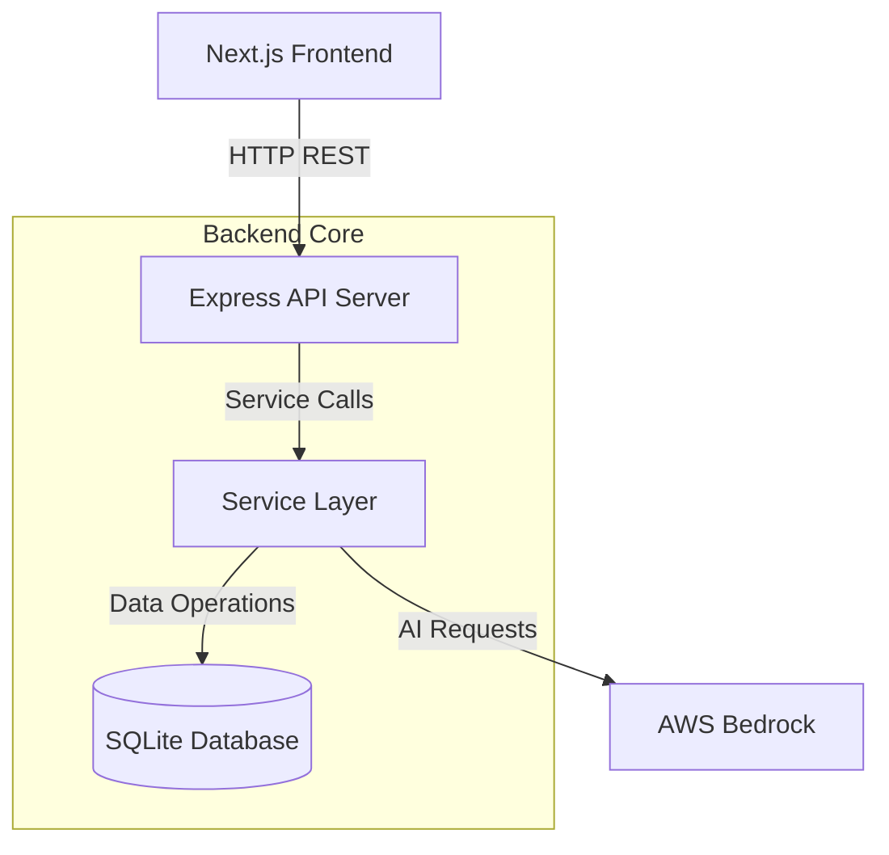
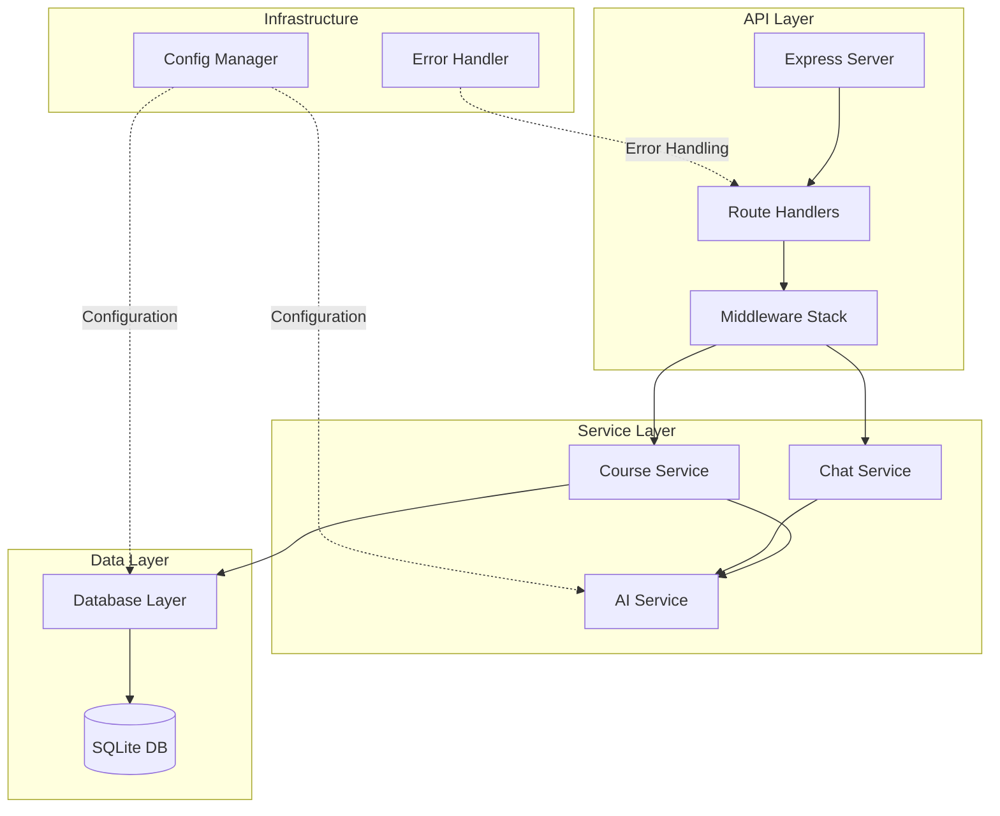
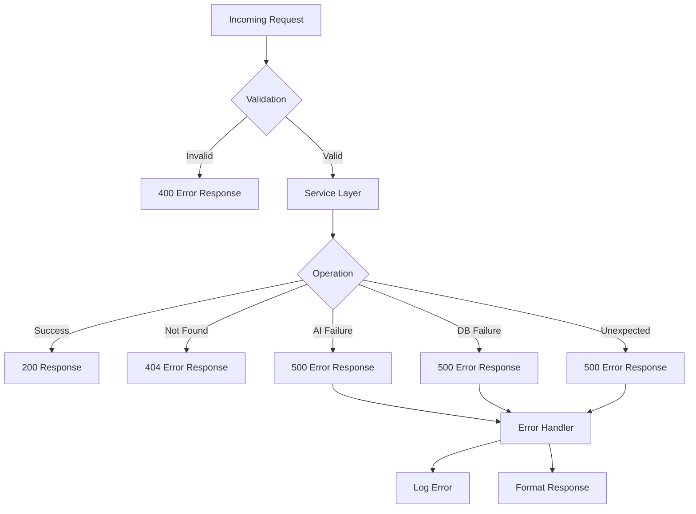

# Backend Core - Design Document

## Overview

The Backend Core is a lightweight Node.js REST API server that provides AI-powered course generation and tutoring capabilities for the AI Vidya for Bharat platform. Built with Express.js, it serves as the bridge between the Next.js frontend and AWS Bedrock AI services, while maintaining course persistence through SQLite.

The system follows a modular service-oriented architecture with clear separation of concerns:

- **API Layer**: Express.js REST endpoints handling HTTP requests/responses
- **Service Layer**: Business logic for course generation, retrieval, and chat functionality
- **AI Integration Layer**: AWS Bedrock communication for AI-powered content generation
- **Data Layer**: SQLite database for course persistence

Key design principles:

- **Simplicity**: Lightweight architecture optimized for hackathon development and demos
- **Modularity**: Clear separation between API, business logic, AI integration, and data persistence
- **Asynchronous Operations**: Non-blocking I/O for AI requests and database operations
- **Error Resilience**: Structured error handling across all layers
- **Stateless Design**: No authentication or session management (guest mode only)

The backend integrates seamlessly with the existing Next.js frontend, which currently has placeholder API routes that will be replaced by calls to this backend service.

---

## Architecture

### System Context



### Component Architecture

The backend follows a layered architecture pattern:



### Module Responsibilities

**API Service (Express Server)**
- HTTP request/response handling
- Route definition and registration
- Request validation middleware
- Error response formatting
- CORS configuration for frontend integration

**Course Service**
- Course generation orchestration
- Course retrieval logic
- Course listing and filtering
- Course deletion operations
- Business logic validation

**Chat Service**
- AI tutor conversation handling
- Course context retrieval for chat
- Message validation and formatting
- Response streaming (future enhancement)

**AI Service**
- AWS Bedrock client initialization
- Prompt construction for course generation
- Prompt construction for tutor responses
- AI response parsing and validation
- Retry logic for transient failures

**Database Layer**
- SQLite connection management
- CRUD operations for courses
- Schema initialization
- Query optimization
- Transaction management

**Config Manager**
- Environment variable loading
- Configuration validation
- Default value management
- Runtime configuration access

**Error Handler**
- Centralized error logging
- Error response standardization
- Error categorization (client vs server errors)
- Stack trace management (dev vs production)

### Data Flow

**Course Generation Flow:**
```
1. Frontend POST /api/generate-course {topic, language}
2. API validates request
3. Course Service receives validated data
4. AI Service constructs prompt
5. AWS Bedrock generates course content
6. AI Service parses JSON response
7. Database Layer stores course
8. Course Service returns courseId
9. API responds with {courseId}
```

**Course Retrieval Flow:**
```
1. Frontend GET /api/course/:id
2. API validates course ID format
3. Course Service queries database
4. Database Layer retrieves course
5. Course Service formats response
6. API responds with full course object
```

**AI Tutor Flow:**
```
1. Frontend POST /api/chat {message, courseId}
2. API validates request
3. Chat Service retrieves course context
4. AI Service constructs tutor prompt with context
5. AWS Bedrock generates response
6. Chat Service formats reply
7. API responds with {reply}
```

---

## Components and Interfaces

### API Endpoints

#### POST /api/generate-course

Generates a new AI-powered course on a specified topic.

**Request:**
```typescript
{
  topic: string;      // Min 3 chars, max 200 chars
  language: string;   // Enum: 'en' | 'hi' | 'ta' | 'te' | 'bn'
}
```

**Response (Success - 200):**
```typescript
{
  courseId: string;   // UUID v4 format
}
```

**Response (Error - 400):**
```typescript
{
  error: string;      // Human-readable error message
}
```

**Response (Error - 500):**
```typescript
{
  error: string;      // "Course generation failed"
}
```

#### GET /api/course/:id

Retrieves a previously generated course by ID.

**Path Parameters:**
- `id`: string (UUID v4 format)

**Response (Success - 200):**
```typescript
{
  id: string;
  title: string;
  topic: string;
  language: string;
  overview: string;
  learning_outcomes: string[];
  chapters: Array<{
    title: string;
    content: string;
  }>;
  created_at: string;  // ISO 8601 timestamp
}
```

**Response (Error - 404):**
```typescript
{
  error: "Course not found"
}
```

#### GET /api/courses

Lists all generated courses (summary view).

**Response (Success - 200):**
```typescript
Array<{
  id: string;
  title: string;
  topic: string;
  language: string;
  created_at: string;  // ISO 8601 timestamp
}>
```

#### DELETE /api/courses

Deletes all courses from the database.

**Response (Success - 200):**
```typescript
{
  message: "All courses deleted successfully"
}
```

**Response (Error - 500):**
```typescript
{
  error: "Failed to delete courses"
}
```

#### POST /api/chat

Sends a message to the AI tutor for a specific course.

**Request:**
```typescript
{
  message: string;    // Min 1 char, max 1000 chars
  courseId: string;   // UUID v4 format
}
```

**Response (Success - 200):**
```typescript
{
  reply: string;      // AI-generated tutor response
}
```

**Response (Error - 400):**
```typescript
{
  error: string;      // Validation error message
}
```

**Response (Error - 404):**
```typescript
{
  error: "Course not found"
}
```

**Response (Error - 500):**
```typescript
{
  error: "Chat service failed"
}
```

### Service Interfaces

#### CourseService

```typescript
interface CourseService {
  generateCourse(topic: string, language: string): Promise<string>;
  getCourse(id: string): Promise<Course | null>;
  listCourses(): Promise<CourseSummary[]>;
  deleteAllCourses(): Promise<void>;
}
```

#### ChatService

```typescript
interface ChatService {
  sendMessage(message: string, courseId: string): Promise<string>;
}
```

#### AIService

```typescript
interface AIService {
  generateCourse(topic: string, language: string): Promise<CourseContent>;
  generateTutorResponse(message: string, courseContext: Course): Promise<string>;
}
```

#### DatabaseLayer

```typescript
interface DatabaseLayer {
  initialize(): Promise<void>;
  saveCourse(course: Course): Promise<string>;
  getCourseById(id: string): Promise<Course | null>;
  getAllCourses(): Promise<CourseSummary[]>;
  deleteAllCourses(): Promise<void>;
}
```

#### ConfigManager

```typescript
interface ConfigManager {
  get(key: string): string | undefined;
  getRequired(key: string): string;
  validate(): void;
}
```

### AWS Bedrock Integration

**Model Selection:**
- Primary: `anthropic.claude-3-sonnet-20240229-v1:0`
- Fallback: `anthropic.claude-3-haiku-20240307-v1:0`

**Request Format:**
```typescript
{
  anthropic_version: "bedrock-2023-05-31",
  max_tokens: 4096,
  messages: [
    {
      role: "user",
      content: string  // Structured prompt
    }
  ]
}
```

**Course Generation Prompt Template:**
```
Generate a beginner-friendly course about "{topic}".

Language: {language}

Return ONLY valid JSON in this exact format:
{
  "title": "Course title",
  "overview": "Brief course overview",
  "learning_outcomes": ["outcome1", "outcome2", "outcome3"],
  "chapters": [
    {
      "title": "Chapter title",
      "content": "Detailed chapter content"
    }
  ]
}

Requirements:
- Include 3-5 learning outcomes
- Create 4-6 chapters
- Each chapter should have substantial content (200-400 words)
- Content should be educational and beginner-friendly
- Use {language} language for all content
```

**Tutor Prompt Template:**
```
You are an AI tutor helping a student learn about: {course.title}

Course Overview: {course.overview}

Learning Outcomes:
{course.learning_outcomes.join('\n')}

Student Question: {message}

Provide a helpful, educational response that:
- Directly answers the question
- Relates to the course content
- Is encouraging and supportive
- Uses {course.language} language
```

---

## Data Models

### Course

The primary data entity representing a generated learning course.

```typescript
interface Course {
  id: string;                    // UUID v4
  title: string;                 // Generated by AI
  topic: string;                 // User-provided topic
  language: string;              // ISO 639-1 code
  overview: string;              // Course description
  learning_outcomes: string[];   // Array of learning objectives
  chapters: Chapter[];           // Course content sections
  created_at: string;            // ISO 8601 timestamp
}
```

**Constraints:**
- `id`: Must be unique, UUID v4 format
- `title`: 1-200 characters
- `topic`: 3-200 characters
- `language`: Must be one of: 'en', 'hi', 'ta', 'te', 'bn'
- `learning_outcomes`: 3-10 items, each 10-200 characters
- `chapters`: 3-10 items
- `created_at`: Must be valid ISO 8601 timestamp

### Chapter

A section within a course containing learning content.

```typescript
interface Chapter {
  title: string;     // Chapter heading
  content: string;   // Educational content
}
```

**Constraints:**
- `title`: 5-100 characters
- `content`: 100-2000 characters

### CourseSummary

Lightweight representation for course listings.

```typescript
interface CourseSummary {
  id: string;
  title: string;
  topic: string;
  language: string;
  created_at: string;
}
```

### ChatMessage

Represents a user message to the AI tutor.

```typescript
interface ChatMessage {
  message: string;    // User question
  courseId: string;   // Associated course
}
```

**Constraints:**
- `message`: 1-1000 characters
- `courseId`: Must be valid UUID v4 and exist in database

### ChatResponse

Represents the AI tutor's reply.

```typescript
interface ChatResponse {
  reply: string;      // AI-generated response
}
```

**Constraints:**
- `reply`: 1-5000 characters

### Database Schema

**SQLite Table: courses**

```sql
CREATE TABLE IF NOT EXISTS courses (
  id TEXT PRIMARY KEY,
  title TEXT NOT NULL,
  topic TEXT NOT NULL,
  language TEXT NOT NULL,
  overview TEXT NOT NULL,
  learning_outcomes TEXT NOT NULL,  -- JSON array
  chapters TEXT NOT NULL,           -- JSON array
  created_at TEXT NOT NULL
);

CREATE INDEX idx_created_at ON courses(created_at DESC);
CREATE INDEX idx_language ON courses(language);
```

**Storage Format:**
- `learning_outcomes`: JSON stringified array
- `chapters`: JSON stringified array of objects
- Database file location: `./data/courses.db` (configurable via `DATABASE_PATH`)

### Configuration Model

```typescript
interface Config {
  AWS_REGION: string;              // e.g., "us-east-1"
  AWS_BEDROCK_MODEL_ID: string;    // e.g., "anthropic.claude-3-sonnet-20240229-v1:0"
  DATABASE_PATH: string;           // e.g., "./data/courses.db"
  PORT?: number;                   // Default: 3001
  NODE_ENV?: string;               // Default: "development"
}
```

### Error Response Model

```typescript
interface ErrorResponse {
  error: string;           // Human-readable error message
  code?: string;           // Optional error code for client handling
  details?: unknown;       // Optional additional context (dev mode only)
}
```

**Error Categories:**
- Validation errors (400): Invalid input format or constraints
- Not found errors (404): Resource doesn't exist
- Server errors (500): AI service failures, database errors, unexpected exceptions

---

## Correctness Properties

*A property is a characteristic or behavior that should hold true across all valid executions of a system—essentially, a formal statement about what the system should do. Properties serve as the bridge between human-readable specifications and machine-verifiable correctness guarantees.*

### Property 1: Input Validation Completeness

*For any* course generation request, if the topic is less than 3 characters, exceeds 200 characters, or the language is not in the allowed set ['en', 'hi', 'ta', 'te', 'bn'], then the system SHALL reject the request with a 400 error response containing an error message.

**Validates: Requirements 1.1, Security.1, Security.2, Security.3**

### Property 2: Course Generation Prompt Structure

*For any* valid topic and language, the constructed AI prompt SHALL contain the topic string, the language specification, and JSON format instructions with the required schema fields (title, overview, learning_outcomes, chapters).

**Validates: Requirements 1.2**

### Property 3: AI Response Parsing Correctness

*For any* valid JSON response from AWS Bedrock that conforms to the course schema, the AI service SHALL successfully parse it into a Course object with all fields correctly mapped and no data loss.

**Validates: Requirements 1.4**

### Property 4: Database Storage Round-Trip

*For any* generated course object, storing it in the database and then retrieving it by ID SHALL return a course object that is equivalent to the original (same title, topic, language, overview, learning_outcomes, chapters).

**Validates: Requirements 1.5**

### Property 5: Course ID Format Validity

*For any* successful course generation, the returned courseId SHALL be a valid UUID v4 format string.

**Validates: Requirements 1.6**

### Property 6: Retrieval Idempotency

*For any* stored course, retrieving it multiple times in succession SHALL return identical course data without triggering additional AI service calls.

**Validates: Requirements 2.1**

### Property 7: Course Listing Completeness

*For any* set of N courses stored in the database, the GET /api/courses endpoint SHALL return exactly N course summaries, each containing id, title, topic, language, and created_at fields.

**Validates: Requirements 3.1**

### Property 8: Course Deletion Completeness

*For any* database state, after executing DELETE /api/courses, the database SHALL be empty and subsequent GET /api/courses SHALL return an empty array.

**Validates: Requirements 4.1**

### Property 9: Chat Context Retrieval

*For any* chat request with a valid courseId that exists in the database, the chat service SHALL successfully retrieve the corresponding course object before constructing the tutor prompt.

**Validates: Requirements 5.1**

### Property 10: Tutor Prompt Context Inclusion

*For any* chat message and course context, the constructed tutor prompt SHALL include the user's message, the course title, the course overview, and all learning outcomes from the course.

**Validates: Requirements 5.2**

### Property 11: Chat Response Format

*For any* successful chat interaction, the response SHALL contain a reply field with a non-empty string value.

**Validates: Requirements 5.4**

### Property 12: Structured Error Handling

*For any* error condition (validation failure, AI service failure, database failure), the system SHALL return a JSON response with an error field containing a human-readable error message, and SHALL NOT expose internal stack traces or sensitive information in production mode.

**Validates: Requirements Error.1, Error.3, Error.4**

### Property 13: Configuration Validation at Startup

*For any* missing required environment variable (AWS_REGION, AWS_BEDROCK_MODEL_ID, DATABASE_PATH), the config manager SHALL throw an error during initialization before the server starts accepting requests.

**Validates: Requirements Config.1**

### Property 14: Chat Message Validation

*For any* chat request, if the message is empty, exceeds 1000 characters, or the courseId is not a valid UUID format, then the system SHALL reject the request with a 400 error response.

**Validates: Requirements 1.1 (applied to chat endpoint)**

### Property 15: Course Not Found Handling

*For any* GET /api/course/:id or POST /api/chat request with a courseId that does not exist in the database, the system SHALL return a 404 error response with the message "Course not found".

**Validates: Requirements Error.1**

---

## Error Handling

The backend implements a layered error handling strategy to ensure graceful degradation and clear error communication.

### Error Categories

**Validation Errors (400 Bad Request)**
- Invalid input format (missing fields, wrong types)
- Constraint violations (string length, enum values)
- Malformed UUIDs
- Empty required fields

**Not Found Errors (404 Not Found)**
- Course ID does not exist
- Invalid route paths

**Server Errors (500 Internal Server Error)**
- AWS Bedrock service failures
- Database connection errors
- JSON parsing failures
- Unexpected exceptions

### Error Handling Flow



### Error Response Format

All errors follow a consistent JSON structure:

```typescript
{
  error: string;        // Human-readable message
  code?: string;        // Optional error code (e.g., "VALIDATION_ERROR")
  details?: unknown;    // Additional context (dev mode only)
}
```

### Error Handling Implementation

**Validation Middleware**
- Validates request body schema
- Checks field constraints
- Returns 400 with specific validation messages
- Example: "Topic must be at least 3 characters"

**Service Layer Error Handling**
- Catches AI service exceptions
- Catches database exceptions
- Transforms technical errors into user-friendly messages
- Logs detailed error information for debugging

**Global Error Handler**
- Catches unhandled exceptions
- Prevents server crashes
- Returns generic 500 error in production
- Includes stack traces in development mode

**AWS Bedrock Error Handling**
- Retry logic for transient failures (network timeouts)
- Exponential backoff (1s, 2s, 4s)
- Maximum 3 retry attempts
- Fallback error message: "Course generation failed"

**Database Error Handling**
- Connection pool management
- Transaction rollback on failures
- Graceful degradation (return empty list on query failure)
- Initialization retry on startup

### Logging Strategy

**Development Mode:**
- Console logging with full stack traces
- Request/response logging
- SQL query logging
- AI prompt/response logging

**Production Mode:**
- Structured JSON logging
- Error-level only (no debug logs)
- Sanitized error messages (no sensitive data)
- Request ID tracking for debugging

---

## Testing Strategy

The Backend Core will be validated through a dual testing approach combining unit tests for specific scenarios and property-based tests for comprehensive coverage.

### Testing Framework Selection

**Unit Testing:**
- Framework: Jest
- Mocking: Jest built-in mocks
- Coverage target: 80% code coverage

**Property-Based Testing:**
- Framework: fast-check (JavaScript/TypeScript property-based testing library)
- Configuration: Minimum 100 iterations per property test
- Each property test must reference its design document property

### Unit Testing Approach

Unit tests focus on specific examples, edge cases, and integration points:

**API Layer Tests:**
- Valid request handling for each endpoint
- Invalid request rejection (malformed JSON, missing fields)
- CORS header verification
- Error response format validation

**Service Layer Tests:**
- Course generation with specific topics
- Course retrieval with known IDs
- Chat service with sample messages
- Edge cases: empty database, duplicate IDs

**AI Service Tests:**
- Mock AWS Bedrock responses
- Prompt construction with specific inputs
- JSON parsing with valid/invalid responses
- Retry logic with simulated failures

**Database Layer Tests:**
- CRUD operations with sample data
- Schema initialization
- Transaction handling
- Connection error scenarios

**Config Manager Tests:**
- Valid configuration loading
- Missing environment variable detection
- Default value application

### Property-Based Testing Approach

Property tests verify universal properties across randomized inputs:

**Property Test Configuration:**
```typescript
// Example property test structure
import fc from 'fast-check';

describe('Property Tests', () => {
  it('Property 1: Input Validation Completeness', () => {
    // Feature: backend-core, Property 1: Input validation completeness
    fc.assert(
      fc.property(
        fc.string({ minLength: 0, maxLength: 2 }), // Invalid topics
        fc.constantFrom('en', 'hi', 'ta', 'te', 'bn', 'fr', 'de'), // Valid + invalid languages
        (topic, language) => {
          // Test validation logic
        }
      ),
      { numRuns: 100 }
    );
  });
});
```

**Property Test Coverage:**

1. **Input Validation (Property 1):**
   - Generate random strings of various lengths
   - Generate random language codes
   - Verify rejection of invalid inputs

2. **Prompt Construction (Property 2):**
   - Generate random valid topics and languages
   - Verify prompt contains required elements

3. **AI Response Parsing (Property 3):**
   - Generate random valid course JSON structures
   - Verify successful parsing and field mapping

4. **Database Round-Trip (Property 4):**
   - Generate random course objects
   - Verify storage and retrieval equivalence

5. **Course ID Format (Property 5):**
   - Generate random valid course data
   - Verify returned IDs are valid UUIDs

6. **Retrieval Idempotency (Property 6):**
   - Generate random courses
   - Verify multiple retrievals return identical data

7. **Listing Completeness (Property 7):**
   - Generate random sets of courses
   - Verify list endpoint returns all courses

8. **Deletion Completeness (Property 8):**
   - Generate random database states
   - Verify deletion empties database

9. **Chat Context Retrieval (Property 9):**
   - Generate random valid courseIds
   - Verify course retrieval before prompt construction

10. **Tutor Prompt Context (Property 10):**
    - Generate random messages and courses
    - Verify prompt includes all required context

11. **Chat Response Format (Property 11):**
    - Generate random chat interactions
    - Verify response structure

12. **Error Handling (Property 12):**
    - Generate random error conditions
    - Verify structured error responses

13. **Config Validation (Property 13):**
    - Generate random environment configurations
    - Verify startup failures for missing required vars

14. **Chat Validation (Property 14):**
    - Generate random invalid chat requests
    - Verify rejection with appropriate errors

15. **Not Found Handling (Property 15):**
    - Generate random non-existent courseIds
    - Verify 404 responses

### Test Data Generators

**fast-check Arbitraries:**

```typescript
// Course topic generator
const topicArbitrary = fc.string({ minLength: 3, maxLength: 200 });

// Language generator
const languageArbitrary = fc.constantFrom('en', 'hi', 'ta', 'te', 'bn');

// Course generator
const courseArbitrary = fc.record({
  id: fc.uuid(),
  title: fc.string({ minLength: 1, maxLength: 200 }),
  topic: topicArbitrary,
  language: languageArbitrary,
  overview: fc.string({ minLength: 10, maxLength: 1000 }),
  learning_outcomes: fc.array(fc.string({ minLength: 10, maxLength: 200 }), { minLength: 3, maxLength: 10 }),
  chapters: fc.array(
    fc.record({
      title: fc.string({ minLength: 5, maxLength: 100 }),
      content: fc.string({ minLength: 100, maxLength: 2000 })
    }),
    { minLength: 3, maxLength: 10 }
  ),
  created_at: fc.date().map(d => d.toISOString())
});

// Chat message generator
const chatMessageArbitrary = fc.string({ minLength: 1, maxLength: 1000 });
```

### Integration Testing

**End-to-End Flow Tests:**
- Complete course generation flow (API → Service → AI → Database → Response)
- Complete chat flow (API → Service → Database → AI → Response)
- Error propagation through layers

**AWS Bedrock Integration:**
- Real API calls in integration test environment
- Verify actual AI responses are parseable
- Test with various topics and languages

**Database Integration:**
- Real SQLite database operations
- Test database file creation and persistence
- Verify schema migrations

### Test Execution Strategy

**Development:**
```bash
npm test              # Run all tests
npm test:unit         # Unit tests only
npm test:property     # Property tests only
npm test:integration  # Integration tests only
npm test:watch        # Watch mode for TDD
```

**CI/CD Pipeline:**
1. Lint and type checking
2. Unit tests (fast feedback)
3. Property tests (comprehensive coverage)
4. Integration tests (real dependencies)
5. Coverage report generation
6. Coverage threshold enforcement (80%)

### Mocking Strategy

**AWS Bedrock Mocks:**
- Mock successful responses with valid JSON
- Mock error responses (throttling, service errors)
- Mock timeout scenarios
- Mock malformed JSON responses

**Database Mocks:**
- In-memory SQLite for unit tests
- Real SQLite file for integration tests
- Mock connection failures
- Mock query errors

**Time Mocking:**
- Mock `Date.now()` for consistent timestamps
- Test created_at field generation

### Coverage Goals

- Overall code coverage: 80%
- Critical paths (course generation, chat): 95%
- Error handling paths: 90%
- Configuration and utilities: 70%

---

